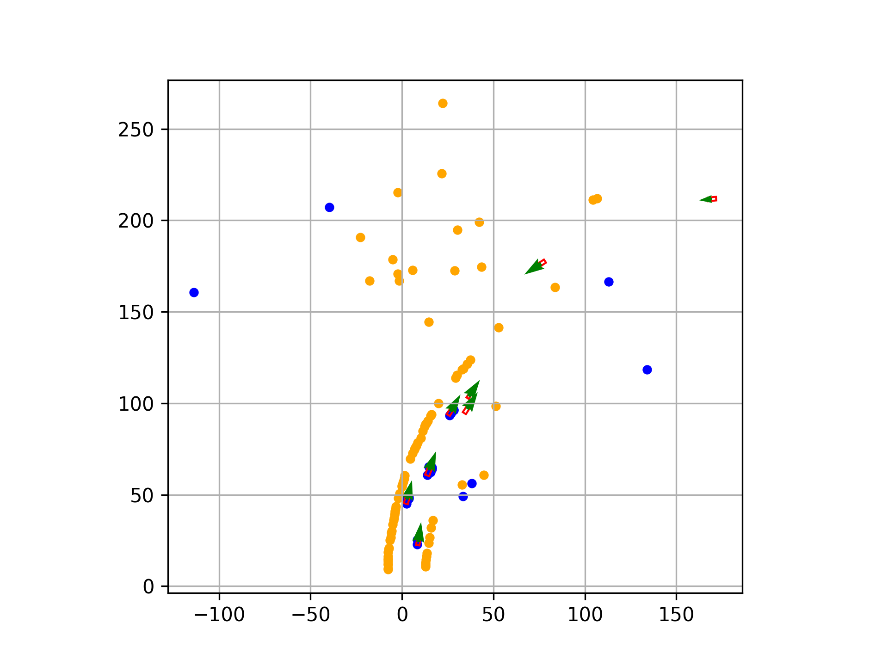
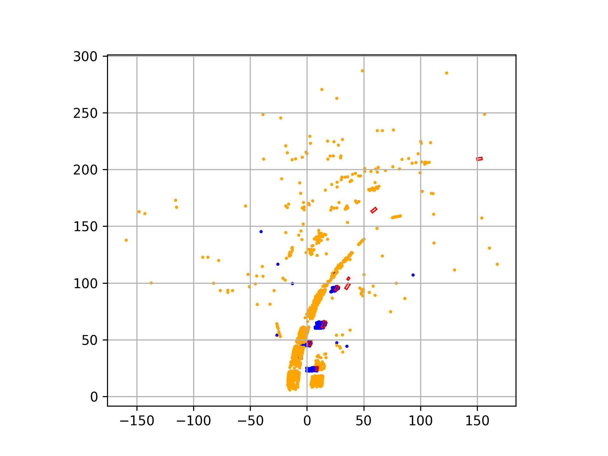
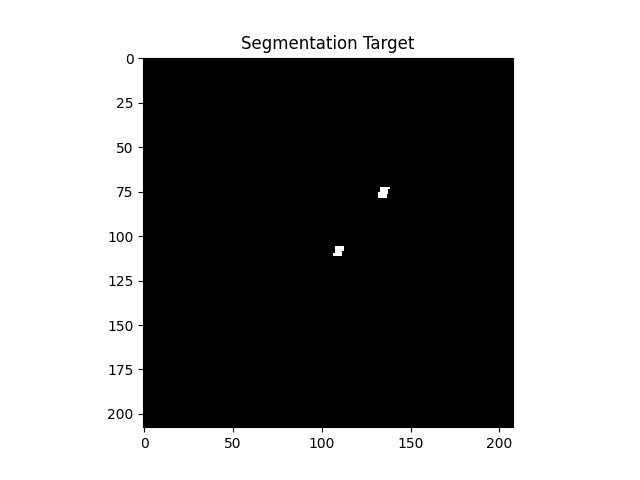
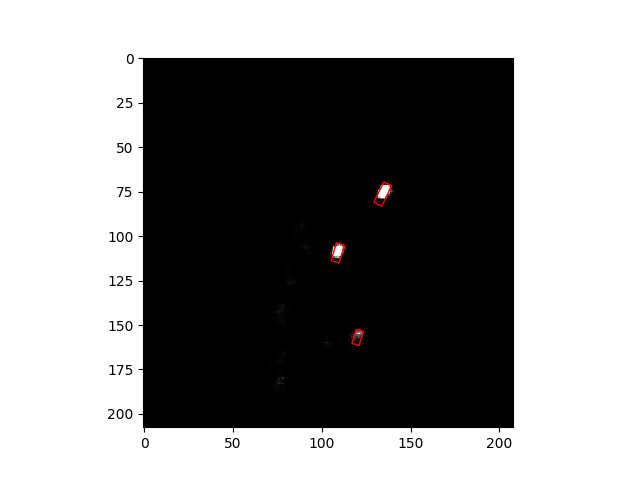
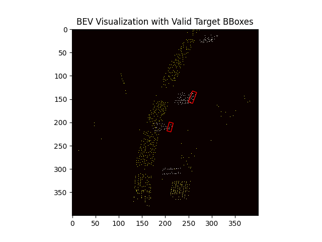

# Automotive Radar BEV Object Detection

This project implements bird's eye view (BEV) object detection using automotive radar data. The model uses a ResNet-based encoder-decoder architecture to predict object locations and classes from radar point clouds.

## Results

**Radar Point Cloud**

**Aggregated Radar Point Cloud**

**Segmentation Target**

**Segmentation Output**

**BEV Visualization**

